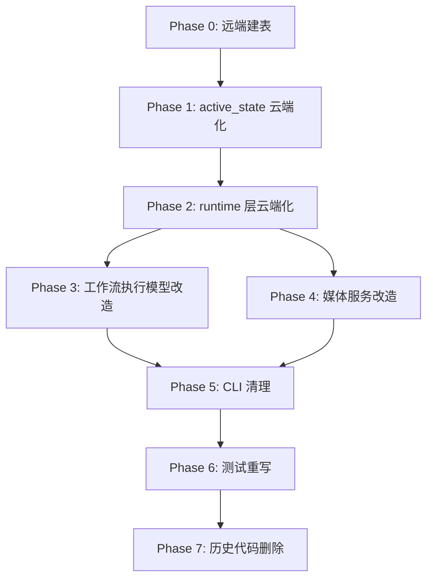

# Sprout 完全转向云数据库迁移方案

## 现状诊断

当前架构呈现**双轨并存**的状态：

- **云端基础设施已就绪**：`module/database/Supabase/` 提供了完整的表访问、Storage 操作、角色授权能力；`agents/sprout/service/cloud_*.py` 提供了项目/资产/版本/运行记录的云端 CRUD 映射。
- **运行时仍走本地**：`project_service.py` 从云端 `projects` 行的 `metadata.local_paths` 还原出本地路径，再读本地 bundle；`workflow_service.py` 通过 `runtime.py`（`SproutRunStore` / `SproutVersionStore`）在本地 `{canonical_root}/runtime/` 下读写 versions/runs/logs/snapshots；`media.py` 直接按本地路径读取图片和视频文件。

问题根源：**云端存储层只在"导入"时使用（`cloud_import_service.py`），日常查询和执行仍走本地文件系统。**

### 未完成项汇总

- 高：运行时仍依赖本地 bundle/runtime/media 文件
- 中高：CLI 还暴露旧命令（`import-project` / `list-projects`）但会直接 `raise NotImplementedError`
- 中：测试还在用本地注册表假数据（`SproutProjectRegistry` + monkeypatch）回避新主路径

---

## 环境与凭证

### Supabase 配置

- 密钥文件：`config/supabase_key.json`（含 `url`、`anon_key`、`service_role_key`）
- 公共配置：`config/supabase_config.json`（含 `storage`、`auth`、`sprout` 默认值）
- 项目内 Supabase 模块：`module/database/Supabase/`
- Supabase Skill 参考：`skills/database/supabase/SKILL.md`

### 火山引擎 AKSK

- 凭证文件：`config/huoshan_aksk.json`
- 用于 Volcengine Supabase CLI 操作（创建表、执行 SQL 等）

### Volcengine Supabase CLI

- Skill 参考：`skills/database/supabase/byted-supabase/SKILL.md`
- CLI 入口：`skills/database/supabase/byted-supabase/scripts/call_volcengine_supabase.py`
- 环境变量：`VOLCENGINE_ACCESS_KEY` / `VOLCENGINE_SECRET_KEY`（对应 `config/huoshan_aksk.json` 中的 `access_key_id` / `secret_access_key`）

常用命令：

```bash
# 设置环境变量（从 config/huoshan_aksk.json 读取）
export VOLCENGINE_ACCESS_KEY="<从 config/huoshan_aksk.json 获取>"
export VOLCENGINE_SECRET_KEY="<从 config/huoshan_aksk.json 获取>"

# 查看 workspace
uv run ./skills/database/supabase/byted-supabase/scripts/call_volcengine_supabase.py list-workspaces

# 执行 SQL（如建表）
uv run ./skills/database/supabase/byted-supabase/scripts/call_volcengine_supabase.py execute-sql \
  --workspace-id <ws-id> --query "SELECT 1"

# 从文件执行 migration
uv run ./skills/database/supabase/byted-supabase/scripts/call_volcengine_supabase.py apply-migration \
  --workspace-id <ws-id> --name sprout_phase2 \
  --query-file ./module/database/Supabase/sprout_phase2_schema.sql
```

### 测试账号

- 邮箱：`sprout-admin@example.com`
- 密码：`Tmp-NrHeNuGvbsSUILd1A1!`

---

## 数据存储方案

各类数据在云端的存储位置和策略：

### 结构化元数据 -> Supabase 数据库表

- **项目信息**（~5KB）：`projects` 表（已有），新增 `active_state` JSONB 列存放激活版本状态
- **成员关系**（~1KB）：`project_members` 表（已有）
- **版本记录**（~1-5KB）：`project_versions` 表（已有）
- **运行记录**（~1-5KB）：`project_runs` 表（已有）
- **资产元数据**（~1-2KB）：`project_assets` 表（已有）

### JSON 快照 -> Supabase Storage

- **Bundle 快照**（10-100KB）：`projects/{project_id}/snapshots/bundle/{snapshot_id}.json`
- **Manifest 快照**（5-50KB）：`projects/{project_id}/snapshots/manifest/{snapshot_id}.json`
- **版本快照**（10-100KB）：`projects/{project_id}/snapshots/node_version/{snapshot_id}.json`

通过 `project_snapshots` 表索引，已有 `cloud_project_store.py` 的 `save_bundle_snapshot()` / `save_snapshot_payload()` 实现。

### 运行日志 -> Supabase Storage

- **日志文本**（1-50KB）：`projects/{project_id}/logs/{run_id}/{run_id}.log`

通过 `project_runs` 表的 `log_bucket_name` / `log_object_path` 引用，已有 `cloud_run_store.py` 的 `save_run_log()` 实现。

### 媒体文件 -> Supabase Storage

- **图片**（角色人设图、镜头关键帧，100KB-5MB）：`projects/{project_id}/assets/{asset_type}/{asset_id}/{file_name}`
- **视频**（镜头视频、最终成片，5MB-500MB）：同上路径

通过 `project_assets` 表索引，已有 `cloud_asset_store.py` 的 `save_asset_file()` 实现。

**前端媒体访问方式**：由 API 层生成 signed URL（`SupabaseStorageService.create_signed_url()`），前端直接从 Storage 下载，不再经 API 代理字节流。

### Supabase 能力评估

**结论：当前 Volcengine Supabase 可以覆盖所有数据类型，无需引入额外存储服务。**

- JSON 数据（<1MB）：表 + Storage 完全胜任
- 图片（<5MB）：Storage REST API 直接上传/下载，无瓶颈
- 视频（5-500MB）：Storage REST API 支持，但需注意：
  - `config/supabase_config.json` 的 `timeout_seconds` 需从 30 调大到 300+（大视频上传）
  - `storage.py` 的 `upload_file()` 用 `read_bytes()` 整体读入，对于 >200MB 文件可能需要后续优化为流式上传
  - 前端视频播放推荐使用 signed URL 直接播放，TTL 可沿用当前 `signed_url_ttl_seconds: 3600`

---

## 迁移执行方案

### Phase 0: 远端建表（前置条件）

**目标**：在 Volcengine Supabase Workspace 上实际执行 schema SQL，创建出二期所需的全部远端表。

操作步骤：

1. 设置环境变量（从 `config/huoshan_aksk.json`）
2. 用 CLI 查看 workspace：`list-workspaces`
3. 执行 `sprout_phase2_schema.sql`（建表 + 创建 Storage bucket）
4. 执行 `sprout_phase2_rls.sql`（RLS 与 Storage policy）
5. 给 `projects` 表补 `active_state` 列：`ALTER TABLE public.projects ADD COLUMN IF NOT EXISTS active_state jsonb NOT NULL DEFAULT '{}'::jsonb;`
6. 用测试账号（`sprout-admin@example.com`）登录验证连通性

涉及文件：

- `module/database/Supabase/sprout_phase2_schema.sql`
- `module/database/Supabase/sprout_phase2_rls.sql`

### Phase 1: 补齐 active_state 云端存储

**目标**：将版本激活状态（当前存于本地 `runtime/active_state.json`）迁移到 `projects` 表。

- 在 `cloud_project_store.py` 中新增 `update_active_state()` / `get_active_state()` 方法
- 在 `cloud_version_store.py` 中新增 `activate_version()` 方法，写入 `projects.active_state` 并返回新状态
- 新增 `cloud_project_store.py` 的 `download_snapshot()` 方法（调用 `storage_service.download_object()`）

涉及文件：

- `agents/sprout/service/cloud_project_store.py`
- `agents/sprout/service/cloud_version_store.py`
- `module/database/Supabase/sprout_phase2_schema.sql`

### Phase 2: 改造 runtime 层为云端主路径

**目标**：让 `project_service.py` 和 `workflow_service.py` 不再依赖本地 `runtime.py`。

**2a: 改造版本读写**

当前本地路径：`runtime.py` 的 `SproutVersionStore` 将版本 JSON 写到 `{canonical_root}/runtime/versions/`，bundle 快照写到 `{canonical_root}/runtime/version_snapshots/`。

改造方向：

- `project_service.py` 的版本查询（`_list_versions_from_record`, `_get_version_detail_from_record`）改为调用 `SproutCloudVersionStore.list_project_versions()` + 从 Storage 下载 snapshot
- `workflow_service.py` 的 `create_version` 改为调用 `SproutCloudVersionStore.upsert_version_record()` + `SproutCloudProjectStore.save_bundle_snapshot()`

涉及文件：

- `agents/sprout/service/project_service.py`
- `agents/sprout/service/workflow_service.py`
- `agents/sprout/service/cloud_version_store.py`
- `agents/sprout/service/cloud_project_store.py`

**2b: 改造运行记录和日志**

当前本地路径：`SproutRunStore` 将 run JSON 写到 `{canonical_root}/runtime/runs/`，日志追加写到 `{canonical_root}/runtime/logs/`。

改造方向：

- 执行过程中仍在本地 temp 目录追加日志（运行期间需要频繁写入）
- 执行结束时 `finish_run` 一次性上传日志到 Storage，同时将 run 记录写入 `project_runs` 表
- 查询日志改为从 Storage 下载

涉及文件：

- `agents/sprout/service/workflow_service.py`
- `agents/sprout/service/cloud_run_store.py`
- `agents/sprout/service/project_service.py`

**2c: 改造 bundle 读取**

当前：`_get_project_detail_from_record()` 调用 `project_store.load_bundle(record.bundle_path)` 读本地文件。

改造方向：

- 从 `projects` 表读取 `current_manifest_snapshot_id`
- 从 `project_snapshots` 表找到对应 Storage object_path
- 从 Storage 下载 bundle JSON 并反序列化为 `SproutProjectBundle`
- `build_record_from_project_row()` 不再需要 `metadata.local_paths`

涉及文件：

- `agents/sprout/service/project_service.py`
- `agents/sprout/service/cloud_project_store.py`

### Phase 3: 改造工作流执行模型

**目标**：`workflow_service.py` 的 `run_node()` 不再依赖 `record.canonical_root` 作为持久目录。

新执行模型：

1. 从 Storage 下载当前 bundle snapshot 到临时目录
2. 如果需要已有资产（如角色图），从 Storage 下载到临时目录
3. 在临时目录执行工作流节点
4. 执行完毕后：
   - 将产出资产（图片/视频）上传到 Storage（via `cloud_asset_store`）
   - 将新 bundle snapshot 上传到 Storage（via `cloud_project_store`）
   - 创建版本记录（via `cloud_version_store`）
   - 上传运行日志（via `cloud_run_store`）
   - 更新 `projects.active_state`
5. 清理临时目录

关键改造点：

- `workflow_service.py` 新增 `_prepare_working_directory()` 和 `_upload_execution_results()` 私有方法
- `run_node()` 使用 `tempfile.TemporaryDirectory()` 替代 `record.canonical_root`

涉及文件：

- `agents/sprout/service/workflow_service.py`
- `agents/sprout/service/cloud_asset_store.py`
- `agents/sprout/service/cloud_project_store.py`
- `agents/sprout/service/cloud_version_store.py`
- `agents/sprout/service/cloud_run_store.py`

### Phase 4: 改造媒体服务

**目标**：`media.py` 不再读本地文件，改为返回 Storage signed URL。

改造方向：

- `SproutMediaService.read_project_media()` 改为：
  1. 从 `project_assets` 表查找资产的 `object_path`
  2. 调用 `storage_service.create_signed_url()` 生成临时 URL
  3. 返回 signed URL 而非字节流
- `http_api.py` 的 `/media` 端点改为返回 `302 redirect` 到 signed URL，或返回 JSON `{"signed_url": "..."}`

涉及文件：

- `agents/sprout/service/media.py`
- `agents/sprout/service/http_api.py`
- `agents/sprout/service/cloud_asset_store.py`

### Phase 5: 清理 CLI 死代码

**目标**：删除会报错的旧命令，保留有意义的云端命令。

- 从 `run.py` 中删除 `import-project` 和 `list-projects` 命令及相关 parser 函数
- 保留 `serve-api`（API 服务入口）
- 评估其余 CLI 命令（plan-topic, build-characters 等）：如果纯本地开发仍有价值则保留，否则也删除

涉及文件：

- `agents/sprout/run.py`

### Phase 6: 重写测试

**目标**：测试覆盖云端主路径，而非 monkeypatch 回本地。

- 删除 `test_sprout_backend_phase1.py` 中 `_build_services()` 对 `SproutProjectRegistry` 的依赖和所有 monkeypatch
- 测试改为 mock `SproutCloudProjectStore` / `SproutCloudVersionStore` / `SproutCloudRunStore`（mock 云端 API 调用，而非整个服务方法）
- 确保测试验证的是：`project_service` -> `cloud_project_store` -> (mocked table_service) 这条链路
- 使用测试账号 `sprout-admin@example.com` 做真实联调时的认证验证

涉及文件：

- `agents/sprout/tests/test_sprout_backend_phase1.py`
- `agents/sprout/tests/test_sprout_backend_phase2.py`

### Phase 7: 删除历史代码

以下文件/代码在迁移完成后应删除：

- `agents/sprout/service/registry.py` - 旧本地 JSON 注册表
- `agents/sprout/service/filesystem_versions.py` - 从本地文件推断版本
- `agents/sprout/service/runtime.py` - 本地 runtime 读写（整个文件替换为云端存储）
- `data/sprout/project_registry/projects.json` - 本地注册表数据文件
- `SproutImportedProjectRecord` 中的本地路径字段（`project_root`, `canonical_root`, `bundle_path`, `manifest_path`, `cover_asset_path`）
- `cloud_project_store.py` 中 `build_project_row()` 的 `metadata.local_paths` 逻辑
- `cloud_project_store.py` 中 `build_record_from_project_row()` 的本地路径还原逻辑
- `cloud_import_service.py` - 整个文件（导入完成后不再需要，或改为一次性迁移脚本）
- `project_service.py` 中所有 `raise NotImplementedError` 的旧方法
- `__init__.py` 中对删除模块的导出

---

## 迁移顺序与风险控制



- Phase 0 是硬性前置条件，远端表不存在则后续全部阻塞
- Phase 1-2 是核心改造，改完后**运行时不再写入本地 runtime 目录**
- Phase 3 是最复杂的改造，改完后**执行时不再依赖持久本地项目目录**
- Phase 4 独立于 Phase 3，可并行
- Phase 5-7 是清理工作，在功能迁移完毕后执行
