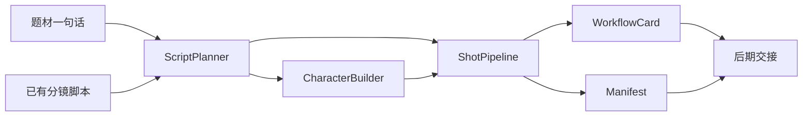

# Sprout 项目计划

## 项目目标

`sprout` 代表最初发芽的 AIGC 方案，一期聚焦 AI 短剧工作流，优先支持从一句题材快速生成可继续生产的短剧项目包。

目标主链路：

1. 题材一句话输入
2. 生成标题、爽点、人物卡、分镜脚本
3. 生成角色参考图
4. 按镜头生成有声视频
5. 输出镜头清单、素材清单和后期拼接交接信息

## 一期范围

- 复用现有 `module/api/seed/llm.py` 做题材扩写与分镜结构化。
- 复用现有 `module/api/seed/image.py` 做角色定妆图与补充参考图生成。
- 复用现有 `module/api/seed/video.py` 做图生视频、有声输出、轮询和落盘。
- 输出一套可供 API 调用和网页端复用的镜头执行卡。
- 剪辑拼接先保留为后处理步骤，一期不做自动剪辑。

## 官方能力对齐

### 有声视频

- `generate_audio` 为官方标准参数。
- `sprout` 一期默认按有声视频规划。

### 多图绑定

- 多参考图绑定采用官方推荐的 `"[图1] ... [图2] ..."` 写法。
- `sprout` 需要记录参考图上传顺序，并保证 prompt 中的编号与上传顺序严格一致。
- 主图优先作为 `first_frame`，额外参考图按 `reference_image` 组织。

## 目标目录

- `agents/sprout/`：项目代码与开发文档
- `data/sprout/`：项目输入、角色图、镜头图、视频、清单等数据
- `wiki/sprout/`：可复用方法论沉淀
- `doc/20260405/`：本轮项目启动与阶段记录

## 一期模块

- `project_schema`：统一定义 `topic`、`character`、`shot`、`reference_binding`、`workflow_card`、`manifest`
- `script_planner`：支持 `一句题材 -> 短剧策划输出` 与 `已有分镜脚本 -> 结构化镜头表`
- `character_builder`：负责角色提示词、角色图生成和角色资产归档
- `shot_pipeline`：负责官方 `[图N]` 绑定提示、有声图生视频、轮询和落盘
- `jimeng_packager`：负责输出即梦执行卡和网页端备用提示
- `exporter`：负责导出项目清单、镜头清单、后期交接信息

## 数据流

## 验收标准

- 能从一句题材生成一份可读、可消费的短剧项目规划结果。
- 能生成并保存 3 个主角色参考图。
- 能至少跑通 1 个镜头的有声视频生成与落盘。
- 单镜头 prompt 中包含与上传顺序一致的 `[图N]` 绑定信息。
- 文档层面补齐项目说明、方法说明与工作记录。

## 实施顺序

1. 建立 `sprout` 目录与项目文档
2. 定义统一数据结构与目录约定
3. 接入剧本规划与角色资产生成
4. 接入镜头视频生成与 `[图N]` 绑定
5. 补齐导出清单和网页端备用执行卡
